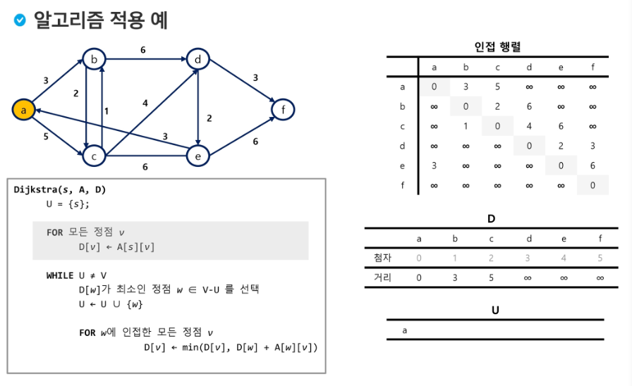

# Graph

###### 2019 04 01

***

그래프 : 실제 세계에 있는 위치 기반을 표현 할 수도 있고, 논리적인 관계를 표현 할 수 있다( 비선형 구조 : 트리, 재귀, 백트래킹이 작동하는 방식은 결국 그래프이다.)
즉 상태 공간이 트리가 되기 때문에 DFS나 BFS 알고리즘을 적용 할 수 있다. 이 DFS, BFS를 스택, 큐로 구현하기도 했음. 물론 Linked List로도 구현 가능하다.

## 

## 1. 그래프( G ) => { V(vertex), E(Edge) }

### 1 ) 그래프의 정의

그래프는 아이템(사물 또는 추상적 개념)들과 이들 사이의 연결 관계를 표현한다.

그래프는 정점들의 집합과 이들을 연결하는 간선들의 집합으로 구성된 자료 구조이다.

* | V | : 정점의 개수, | E | : 그래프에 포함된 간선의 개수
* | V | 개의 정점을 가지는 그래프는 최대 | V | ( | V | - 1) / 2 간선이 가능하다
  * 5개 정점이 있는 그래프의 최대 간선 수는 10 = ( 5* 4 / 2)

선형 자료구조나 트리 자료구조로 표현하기 어려운 N:M 관계를 가지는 원소를 표현하기에 용이하다

### 2 ) 그래프의 유형

무향 그래프(Undirected Graph), 유향 그래프(Directed Graph), 가중치 그래프(Weighted Graph), 사이클 없는 방향 그래프(DAG, Directed Acyclic Graph)

* 완전 그래프 : 정점들에 대해 가능한 모든 간선들을 가진 그래프 : | V| ( | V | -1 ) / 2
* 부분 그래프 : 원래 그래프에서 일부의 정점이나 간선을 제외한 그래프

인접(Adjancency) : 두 개의 정점에 간선이 존재(연괼됨)하면 서로 인접해 있다고 함 => connected가 아닌 Adjancency
완전 그래프에 속한 임의의 두 정점들은 모두 인접해 있다.

### 3) 그래프 경로

경로란 간선들을 순서대로 나열한 것.
단순 경로 : 경로 중 한 정점을 최대 한번만 지나는 경로
사이클 : 시작한 정점에서 끝나는 경로

### 4) 그래프 표현

간선의 정보를 저장하는 방식으로 메모리나 성능을 고려해서 결정하는데

* 인접 행렬(Adjacent matrix) : | V | x | V | 크기의 2차원 배열을 이용해서 간선 정보를 저장. 배열의 배열(포인터 배열)
  * 행 번호와 열 번호는 그래프의 정점에 대응하며 두 정점이 인접되면 1, 그렇지 않으면 0
  * 무방향 그래프 i 번째 행의 합 = i 번째 열의 합 = Vi의 차수
  * 유향 그래프 행 i의 합 = Vi 의 진출 차수
  * 유향 그래프 열 i의 합 = Vi의 진입 차수
* 간선의 배열(Array of Edge) : 간선(시작 V, 끝 V) 를 배열에 연속적으로 저장


적은 정보를 표현하는데 많은 메모리를 사용한다.


* 인접 리스트(Adjancent List) : 각 정점마다 해당 정점으로 나가는 간선의 정보를 저장
  * 각 정점에 대한 인접 정점들을 순차적으로 표현하며
  * 하나의 정점에 대한 인접 정점들을 각각 노드로 하는 연결 리스트로 저장


* 이렇게 Linked List로 구현할 수 있으며, 이를 2차원 배열을 통해 진입 차수와 진출 차수를 카운팅하여 계산하는 방법 또한 존재한다.
* 메모리를 더 많이 쓰나 append와 pop이 비싼 연산이기 때문에 접근 시 더 효율적으로 사용이 가능하다

***

## 2. 그래프 탐색

그래프 순회는 비선형 구조인 그래프로 표현된 모든 자료를 빠짐없이 탐색하는 것을 의미하며 두 가지 방법 `깊이 우선 탐색(DFS)` 와 `너비 우선 탐색(BFS)`가 있다

### 1. DFS(Depth First Search)

  시작 정점의 한 반향으로 갈 수 있는 경로가 잇는 곳까지 깊이 탐색해 가다 더 이상 갈 곳이 없게 되면 가장 마지막에 만났던 갈림길 간선이 있는 정점으로 되돌아와서 다른 방향의 정점으로 탐새글 계속 반복하여 모든 정점을 방문하는 순회 방법

가장 마지막에 만났던 갈림길의 정점으로 되돌아가 다시 깊이 우선 탐색을 반복해야 하므로 스택을 사용한다.

```python
def DFS_Recursive(G ,V):
    visited[v] = 1
    
    for w in adjacency(G, V):
        if not visited[w]:
            DFS_Recursive(G, w)
```

```python
STACK s
visited []
DFS(v)
	push(s, v)
    while not isEmpty(s):
        v = s.pop()
        if not visited[v]:
            visited[v] = 1
            for w in adjacency(v):
                if not visited[w]:
                    s.push(w)
```

***

### 2. BFS(Breadth First Search)

탐색 시작점의 인접한 정점들을 먼저 모두 차례로 방문한 후 방문했던 정점을 시작점으로 하여 다시 인접한 정점들을 차례로 방문하는 방식

인접한 정점들에 대해 탐색을 한 후 차례로 다시 BFS를 진행해야 하므로 큐를 활용함

```python
def bfs(v):
    q = []
    q.append(v)
    while q:
        v = q.pop(0)
        if not visited[v]:
            visited[v] = 1
            print(v, end=" ")
            for w in edges[v]:
                if not visited[w]:
                    q.append(w)

tin = [1, 2, 1, 3, 2, 4, 2, 5, 4, 6, 5, 6, 6, 7, 3, 7]
edges = [ [] for i in range(8)]

while tin:
    x = tin.pop(0)
    y = tin.pop(0)
    edges[x] = y
    edges[y] = x
```

***

## 3. 서로소 집합(Disjoint - sets)

서로소 또는 상호배타 집합들은 서로 중복 포함된 원소가 없는 집합. 교집합이 없다

집합에 속한 하나의 특정 멤버를 통해 각 집합들을 구분, 이를 대표자(representative, 트리에서 루트(Root) )라 한다.

상호 배타 집합을 표현하는 방법으로

* 연결 리스트
* 트리

가 존재하며, 상호배타 집합 연산으로

* Make-Set( x )
* Find-Set( x )
* Union( x, y )

***

## 4. 최소 신장 트리(MST  Minimum Spanning Tree)

그래프에서 최소 비용 문제. Tree라는 것은 사이클이 없음을 이야기 한다.
트리를 하나 하나 씩 확장해 간다는 의미로 Span이라는 단어를 사용한다.

* 모든 정점을 연결하는 간선들의 가중치의 합이 최소가 되는 트리
* 두 정점 사이의 최소 비용의 경로 찾기

신장 트리 : n개의 정점으로 이루어진 무향 그래프에서 n 개의 정점과 n-1개의 간선으로 이루어진 트리

최소 신장 트리 : 무향 가중치 그래프에서 신장 트리를 구성하는 간선들의 `가중치의 합이 최소`인 신장 트리


위 그림 처럼 MST를 표현할 때 2차원 행렬 또는 Linked List로 표현한다.

Tree : 사이클이 없는 무방향 그래프

MST 에서 모양을 물어보는게 아닌 주로 가중치의 합 중 최소인 것을 물어보는 경우가 많다.

### 1) MST의 표현

* 그래프
* 간선들의 배열
* 인접 리스트
* 부모 자식관계와 가중치에 대한 배열


### 2) Prim 알고리즘

정점 중심

원래 집합과 공집합이 있고, 가장최적인걸 하나 뽑아서 옮겨 놓는다. 그리고 여기에 set이 구성되어 있으면 기본 상태에서 또 최적이 무엇인지 확인하는 것.

하나의 정점에서 연결된 간선들 중에 하나씩 선택하면서 MST를 만들어 가는 방식

* 임의 정점을 하나 선택해서 시작
* 선택한 정점과 인접하는 정점들 중의 최소 비용의 간선이 존재하는 정점을 선택
* 모든 정점이 선택될 때 까지 위 과정을 반복

서로 소인 2개의 집합 (2 disjoint-sets) 정보를 유지

* 트리 정점들(Tree vertices) : MST를 만들기 위해 선택된 정점들
* 비트리 정점들(non-Tree vertices) : 선택 되지 않은 정점들

선택 집합과 비선택 집합들의 간선만을 살펴 본다.

```python
# Sudo Code
MST_PRIM(G, r) # G: 그래프, r : 시작 정점
        for u in G[v]:
            u.key = 987654321
            u.pi = None
        r.key = 0
        Q = G[v]
        while Q:
            u = Extract_min(Q) # 가장 낮은것을 찾으시오 !
            for v in G.Adj[u]:
                if v in Q and w(u, v) < v.key:
                    v.pi = u
                    v.key = w(u, v)
```

***

### 3) KRUSKAL 알고리즘

간선의 가중치로 Sorting하고 간선을 Vertex - 1개로 뽑으면 된다

1. 최초, 모든 간선을 가중치에 따라 오름차순 정렬
2. 가중치가 가장 낮은 간선부터 선택하면서 트리 증가

   - 사이클이 존재하면 다음으로 가중치가 낮은 간선 선택
3. n-1 개의 간선이 선택될 때 까지 2를 반복

```python
MST-KRUSKAL(G, W):
    A = 0
    for vertex v in G.V
    	Make_Set(v)
    
    for (u, v) in G.E:
        if find_set(u) != find_set(v):
            A = A.union{(u, v)}
	return A
```


***

## 5. 최단 경로

### 1) 정의

간선의 가중치가 있는 그래프에서 두 정점 사이의 경로들 중 간선의 가중치의 합이 최소인 경로.

가중치가 없고 모든 정점 경우하지 않는 경우 => BFS

가중치가 있고 모든 정점 경우하지 않는 경우 => Dijkstra(음의 가중치 허용x), Bellman-Fod(음의 가중치 허용) Floyd(음의 가중치 허용)

가중치가 있고 모든 정점 경우하는 경우 => TSP

* 하나의 시작 정점에서 끝 정점까지의 최단 경로를 구하는 문제
  * 다익스트라(dijkstra) 알고리즘
  * 벨만-포드(Bellman-Ford) 알고리즘

* 모든 정점들에 대한 최단 경로
  * 플로이드-워샬(Floyd-Warshall) 알고리즘

### 2) Dijkstra 알고리즘

```
D[i][j][k] = str(a)
```

시작 정점에서 거리가 최소인 정점을 선택해 나가면서 최단 경로를 구하는 방식

시간복잡도 O(n^2)

시작정점에서 끝 정점 까지의 최단 경로에 정점 x가 존재하며 이때 최단경로는 s에서 x까지의 최단 경로와 ,x에서 t까지의 최단경로로 구성된다

탐욕 기법을 사용한 알고리즘으로 MST 의 프림 알고리즘과 유사하다

```python
# sudo code
# s: 시작, A : 인접 행렬, D : 거리 V : 정점 집합, U : 선택된 정점 집합

def Dijkstra(s, A, D):
    U = {s};
    
    for 모든 정점 v:
        D[v] = A[s][v]
    while U != V:
        D[w]가 최소인 정점 w in V-U 선택
        U = U.union({w})
        
        for w 에 인접한 모든 정점 v:
            D[v] = min(D[v], D[w] + A[w][v])
    
```



***

### 3) Floyd Algorhytm

모든 쌍 최단 경로

시간 복잡도 O(n^3)

```python
D[i][j]
AllPairsShortest(D[][]):
    for k in (1, n): # 중간
        for i in (1, n): # 시작
            for j in (1, n): # 도착
                D[i][j] = min(D[i][k] +D[k][j], D[i][j])
```


